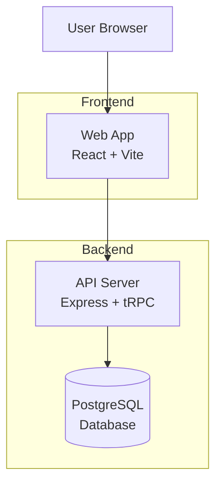
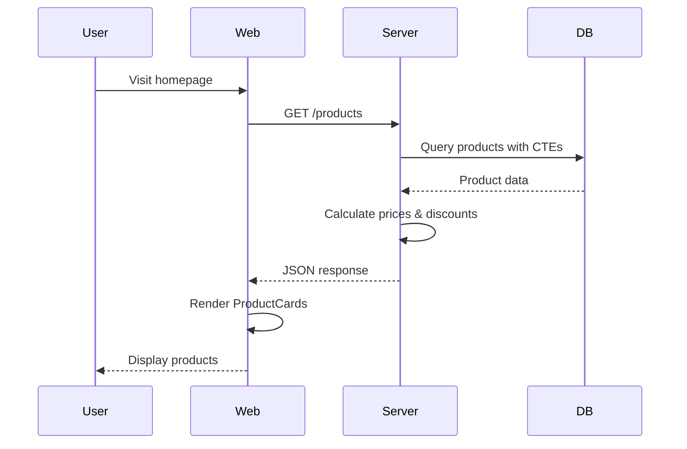
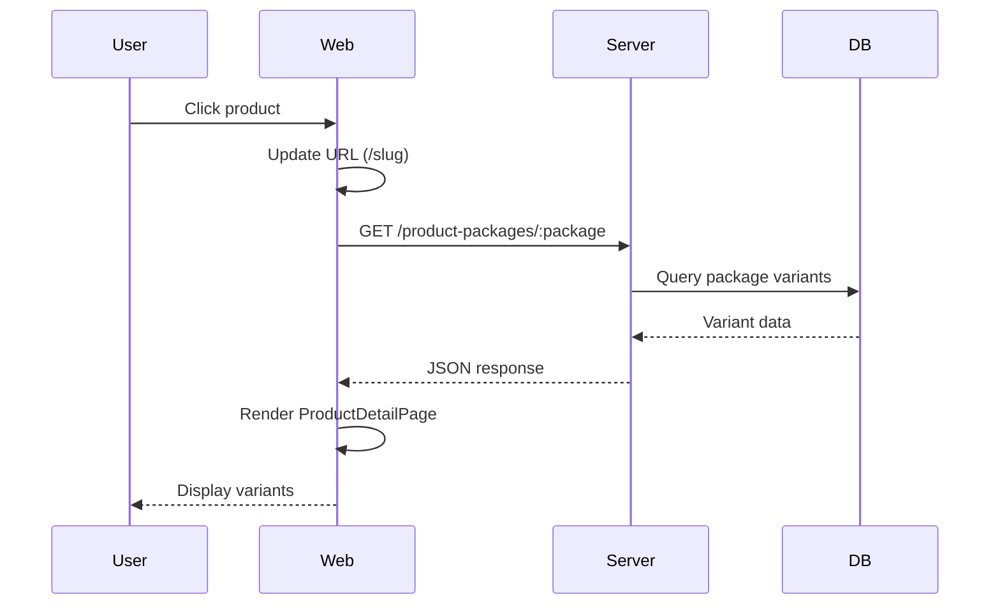

# my-store Architecture

## System Overview

my-store is a modern e-commerce platform built with a monorepo architecture, featuring a React frontend and Express backend with PostgreSQL database.

## Architecture Diagram



## Technology Stack

### Frontend (`apps/web`)
- **Framework**: React 19
- **Build Tool**: Vite 6
- **Styling**: TailwindCSS 4
- **UI Components**: shadcn/ui
- **State Management**: React hooks
- **Theme**: next-themes (dark mode)
- **Icons**: Lucide React
- **Testing**: Vitest + Testing Library

### Backend (`apps/server`)
- **Runtime**: Node.js
- **Framework**: Express 5
- **API**: tRPC 11 (type-safe APIs)
- **Database ORM**: Prisma
- **Validation**: Zod
- **Development**: tsx watch

### Database
- **Engine**: PostgreSQL
- **ORM**: Prisma
- **Schema**: Multi-schema design
- **Migrations**: Prisma Migrate

### Shared Packages
- `@my-store/api` - tRPC API layer
- `@my-store/db` - Database client and schema
- `@my-store/config` - Shared configurations
- `@my-store/env` - Environment variable validation

### AI / Developer context (NeuralMemory)
- **NeuralMemory** dùng để lưu và truy vấn ký ức theo association (spreading activation). Cursor MCP đã cấu hình tại `.cursor/mcp.json`; scripts: `npm run memory:remember`, `memory:recall`, `memory:context`. Chi tiết: [docs/NEURAL_MEMORY.md](./NEURAL_MEMORY.md).

## Project Structure

```
my-store/
├── apps/
│   ├── web/                    # Frontend application
│   │   ├── src/
│   │   │   ├── components/     # React components
│   │   │   │   ├── ui/        # Reusable UI components
│   │   │   │   └── pages/     # Page components
│   │   │   ├── lib/           # Utilities and helpers
│   │   │   ├── App.tsx        # Main app component
│   │   │   └── main.tsx       # Entry point
│   │   ├── public/            # Static assets
│   │   └── package.json
│   │
│   └── server/                 # Backend application
│       ├── src/
│       │   ├── config/        # Configuration files
│       │   └── index.ts       # Main server file
│       └── package.json
│
├── packages/
│   ├── api/                   # tRPC API definitions
│   │   └── src/
│   │       ├── context.ts     # tRPC context
│   │       ├── index.ts       # Router exports
│   │       └── routers/       # API routers
│   │
│   ├── db/                    # Database layer
│   │   ├── prisma/
│   │   │   └── schema/        # Prisma schema
│   │   ├── docker-compose.yml # Local PostgreSQL
│   │   └── src/               # Database client
│   │
│   ├── config/                # Shared configs
│   └── env/                   # Environment validation
│
├── .eslintrc.json            # ESLint configuration
├── .prettierrc               # Prettier configuration
├── package.json              # Root package.json
└── README.md
```

## Data Flow

### Product Listing Flow



### Product Detail Flow



## Database Schema

### Core Tables

#### `variant` (Product Variants)
- Stores individual product variants
- Links to product packages
- Contains display names and active status

#### `product` (Product Packages)
- Groups variants into packages
- Contains package names and categories
- Links to categories

#### `price_config` (Pricing Configuration)
- Stores pricing percentages (CTV, customer, promo)
- Historical pricing data
- Links to variants

#### `supplier_cost` (Supplier Costs)
- Base costs from suppliers
- Links to variants
- Used for price calculations

#### `product_desc` (Product Descriptions)
- Product descriptions and images
- Links to products by display name

#### `category` (Categories)
- Product categorization
- Hierarchical structure

#### `order_list` & `order_expired` (Orders)
- Order tracking
- Sales count aggregation

### Pricing Calculation

```
sale_price = pct_ctv × price_max × pct_khach
promo_price = sale_price × (1 - pct_promo)
```

Where:
- `pct_ctv`: CTV percentage
- `price_max`: Maximum supplier cost
- `pct_khach`: Customer percentage
- `pct_promo`: Promotion percentage

## API Design

### REST Endpoints

The server exposes REST endpoints for:
- `/products` - Product listing
- `/categories` - Category listing
- `/product-packages/:package` - Package variants
- `/` - Health check

### tRPC Integration

tRPC is configured but not heavily used yet. Future endpoints will use tRPC for type-safe APIs.

## Frontend Architecture

### Component Hierarchy

```
App
├── ErrorBoundary
│   ├── ModeToggle
│   ├── HomePage
│   │   ├── Header
│   │   ├── BannerSlider
│   │   ├── CategoryFilter
│   │   ├── ProductCard (multiple)
│   │   ├── Pagination
│   │   └── PromotionCarousel
│   │
│   ├── ProductDetailPage
│   │   ├── Header
│   │   ├── Product Info
│   │   ├── Variant Selector
│   │   └── Related Products
│   │
│   └── FloatingLogo
```

### State Management

- **Local State**: React useState for component state
- **URL State**: Browser history API for routing
- **Theme State**: next-themes for dark mode

### Routing

Custom client-side routing using:
- `window.history.pushState()` for navigation
- `popstate` event for back/forward
- URL parsing for initial state

## Performance Optimizations

### Database
- **CTEs** for complex queries
- **Indexes** on frequently queried columns
- **Connection pooling** via Prisma

### Frontend
- **Code splitting** via Vite
- **Lazy loading** for images
- **Memoization** with React.memo
- **Debouncing** for search/filter

### Backend
- **Query optimization** with CTEs
- **Data deduplication** in memory
- **Efficient joins** in SQL

## Security Considerations

### Current Implementation
- **CORS** configured for allowed origins
- **SQL Injection** prevented by Prisma
- **Input Validation** with Zod (planned)

### Future Improvements
- Rate limiting
- Authentication/authorization
- API key management
- Request logging
- Error tracking

## Deployment Architecture

### Development
```
localhost:3001 (Web) → localhost:4001 (Server) → PostgreSQL (Docker)
```

### Production (Planned)
```
CDN → Web App (Static) → Load Balancer → API Servers → PostgreSQL (Managed)
```

## Scalability

### Horizontal Scaling
- Stateless API servers
- Load balancer distribution
- Database read replicas

### Caching Strategy
- Client-side caching (React Query)
- Server-side caching (Redis - planned)
- CDN for static assets

## Monitoring & Logging

### Current
- Console logging
- Error boundaries

### Planned
- Structured logging (Winston/Pino)
- Error tracking (Sentry)
- Performance monitoring (New Relic/Datadog)
- Uptime monitoring

## Development Workflow

1. **Local Development**
   ```bash
   npm run dev  # Starts both web and server
   ```

2. **Testing**
   ```bash
   npm test     # Run all tests
   npm run lint # Check code quality
   ```

3. **Building**
   ```bash
   npm run build  # Build all workspaces
   ```

4. **Database**
   ```bash
   npm run db:start   # Start PostgreSQL
   npm run db:push    # Push schema changes
   npm run db:studio  # Open Prisma Studio
   ```

## Design Decisions

### Monorepo
**Why**: Code sharing, unified tooling, easier refactoring
**Trade-off**: Larger repository, more complex setup

### Prisma
**Why**: Type-safe database access, great DX, migrations
**Trade-off**: Learning curve, some performance overhead

### Vite
**Why**: Fast HMR, modern tooling, great DX
**Trade-off**: Newer ecosystem than Webpack

### TailwindCSS
**Why**: Rapid development, consistent design, small bundle
**Trade-off**: HTML can get verbose

## Future Enhancements

1. **Authentication**: User accounts and auth
2. **Shopping Cart**: Cart functionality
3. **Checkout**: Payment integration
4. **Admin Panel**: Product management
5. **Search**: Full-text search
6. **Recommendations**: Product recommendations
7. **Analytics**: User behavior tracking
8. **Mobile App**: React Native app
