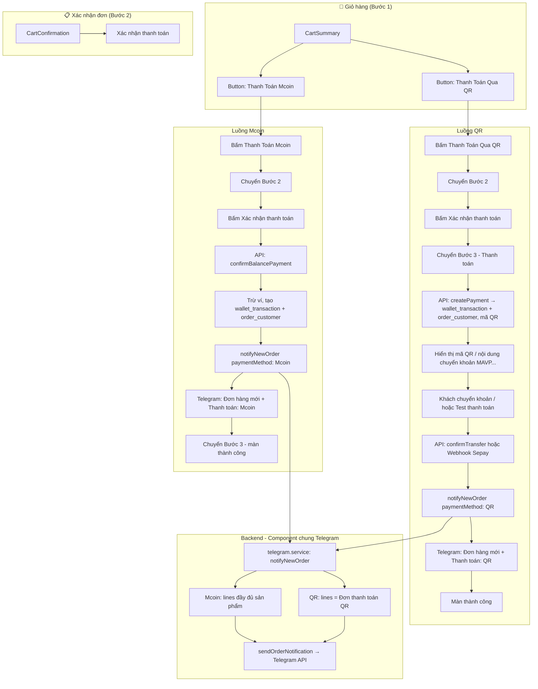
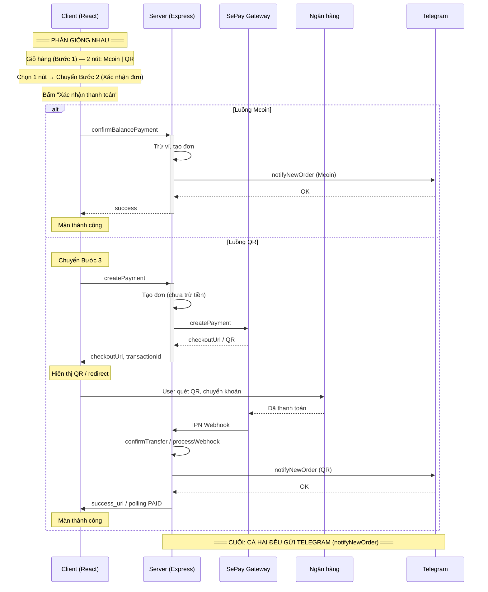

# Task triển khai — Hệ thống đơn hàng & thanh toán

Danh sách công việc cần thực hiện theo [ORDER_SYSTEM.md](./ORDER_SYSTEM.md). Đánh dấu khi hoàn thành.

**Quy ước:** Có note mới trong file .md thì ghi ở **cuối file** với tiêu đề **Update release x.xx** (ví dụ: Update release 1.01).

---

## A. Giao diện giỏ hàng (Frontend)

- [x] **A1** Đổi text nút "Thanh Toán" thành "Thanh Toán Mcoin".
- [x] **A2** Giữ nguyên nút "Mua Siêu Tốc Qua..." (thanh toán QR).
- [x] **A3** Loại bỏ 3 nút thanh toán còn lại (chỉ còn 2 nút: Mcoin + Mua Siêu Tốc).
- [x] **A4** Loại bỏ 2 dòng text: "Số dư hiện tại" và "Số tiền cần nạp thêm".
- [x] **A5** Disable nút "Thanh Toán Mcoin" khi tổng thanh toán > số dư Mcoin (`wallet.balance`); enable khi đủ số dư.
- [x] **A6** Bấm "Thanh Toán Mcoin" → chuyển đến trang xác nhận thanh toán.
- [x] **A7** Bấm "Mua Siêu Tốc Qua..." → chuyển đến trang xác nhận thanh toán.
- [x] **A8** Trang xác nhận: nút "Xác nhận thanh toán" — Mcoin → gọi API thanh toán Mcoin; QR → chuyển bước quét QR.
- [x] **A9** Trang thanh toán QR: hiển thị mã chuyển khoản (transaction_id MAVPXXXXXX) và mã QR (Sepay).
- [x] **A10** Hiển thị thông báo "Thanh toán thành công" sau khi Mcoin thành công hoặc sau khi webhook QR xác nhận (nếu dùng realtime/polling).

---

## B. Database & Schema

- [x] **B1** Xóa cột `promo_code` khỏi bảng `wallet_transaction` (migration + config).
- [x] **B2** Đảm bảo bảng `order_customer` có: `id_order`, `account_id`, `status`, `payment_id` (FK → `wallet_transaction.id`).
- [x] **B3** Đảm bảo bảng `wallet_transaction` có: `id`, `transaction_id`, `account_id`, `type`, `direction`, `amount`, `balance_before`, `balance_after`, `method`, `promotion_id` (không còn `promo_code`).
- [x] **B4** Ràng buộc / index phù hợp cho `payment_id`, `transaction_id`, `account_id` (nếu chưa có).
- [x] **B5** Ràng buộc **UNIQUE** cho `order_customer.id_order` (migration: `order_system_drop_promo_add_promotion_id_unique_order.sql`).

---

## C. Backend — Thanh toán Mcoin

- [x] **C1** API (hoặc service) tạo đơn Mcoin: nhận giỏ hàng + account → tạo 1 `wallet_transaction` (type PURCHASE, method Mcoin, direction DEBIT, balance_before/balance_after, amount).
- [x] **C2** Sinh `transaction_id` dạng MAVPXXXXXX (unique).
- [x] **C3** Trừ số dư ví (`wallet.balance`) theo `amount`; ghi `balance_before` / `balance_after` vào `wallet_transaction`.
- [x] **C4** Tạo bản ghi `order_customer` cho **từng sản phẩm** trong giỏ: cùng `payment_id` (id của wallet_transaction vừa tạo), **mỗi dòng một `id_order` riêng (unique, không trùng)**, prefix MAVL/MAVC/MAVK theo sản phẩm/user, `status` = "Đang Tạo Đơn".
- [x] **C5** Logic chọn prefix `id_order`: MAVL (khách lẻ / không khuyến mãi), MAVC (CTV), MAVK (Deal Sốc); khách chỉ MAVL/MAVK, CTV chỉ MAVC. **Sinh mã id_order unique cho từng dòng (mỗi sản phẩm 1 id).**
- [x] **C6** Trả về thành công + dữ liệu cần thiết để frontend hiển thị thông báo thành công.

---

## D. Backend — Thanh toán QR (Sepay)

- [x] **D1** API tạo đơn QR: tạo `wallet_transaction` (type PURCHASE, method QR, balance_before = balance_after = balance hiện tại, không trừ tiền); sinh `transaction_id` MAVPXXXXXX.
- [x] **D2** Tạo bản ghi `order_customer` cho từng sản phẩm: cùng `payment_id`, **mỗi dòng một `id_order` unique** (không trùng), `status` = "Đang Tạo Đơn".
- [x] **D3** Gọi/tích hợp Sepay để tạo mã QR; trả về cho frontend URL/QR + nội dung chuyển khoản = `transaction_id`.
- [x] **D4** Xử lý webhook Sepay khi thanh toán thành công: cập nhật trạng thái đơn (và ví nếu cần); trigger thông báo thành công cho user (và gửi Telegram theo mục E).

---

## E. Backend — Thông báo Telegram

- [x] **E1** Khi thanh toán thành công (Mcoin hoặc webhook QR): gửi 1 tin nhắn vào Telegram (gửi vào group; nếu bật topic thì gửi vào topic theo `TELEGRAM_TOPIC_ID`).
- [x] **E2** Nội dung tin nhắn đúng định dạng: Mã Đơn Hàng, Sản Phẩm (variant_id + --xm/--xd → tháng/ngày), Thông tin bổ sung (extra_info).
- [x] **E3** Tích hợp với flow Mcoin: gọi gửi Telegram ngay sau khi tạo đơn + transaction thành công.
- [x] **E4** Tích hợp với flow QR: gọi gửi Telegram trong xử lý webhook Sepay khi thanh toán thành công.

---

## F. Tích hợp & kiểm thử

- [ ] **F1** E2E: Giỏ hàng → chỉ 2 nút, Mcoin disable khi thiếu dư → đủ dư → Thanh toán Mcoin → xác nhận → thành công + Telegram.
- [ ] **F2** E2E: Giỏ hàng → Mua Siêu Tốc → xác nhận → QR + nội dung MAVPXXXXXX → giả lập webhook Sepay → thành công + Telegram.
- [ ] **F3** Kiểm tra id_order: MAVL/MAVC/MAVK đúng vai trò user và loại đơn; **mỗi id_order unique, không trùng; mỗi sản phẩm 1 id.**
- [ ] **F4** Kiểm tra `order_customer.payment_id` → `wallet_transaction.id`; 1 giao dịch = 1 wallet_transaction, nhiều dòng order_customer cùng payment_id nhưng **mỗi dòng có id_order riêng.**
- [ ] **F5** Kiểm tra đã xóa hẳn `promo_code`, mọi chỗ dùng promotion chỉ qua `promotion_id`.

---

## Sửa lỗi (đã xử lý)

- [x] **Form thanh toán thành công:** Modal với đếm ngược 5 giây và nút "Về trang chủ"; tự chuyển về trang chủ sau 5s hoặc khi bấm nút. (CartPage: `showPaymentSuccessModal`, countdown, `handleCloseSuccessAndGoHome`.)
- [x] **Console log Telegram:** Thêm log trong `telegram.service.ts` (gọi với params, env, URL, kết quả) và trong `balance-payment.service.ts` khi gửi thông báo để kiểm tra tại sao chưa gửi tin nhắn.
- [x] **Đơn "Đang Tạo Đơn" không hiển thị:** Đổi `getOrders` từ `JOIN order_list` sang `FROM order_customer LEFT JOIN order_list` để hiển thị cả đơn chỉ có trong `order_customer` (chưa có trong `order_list`); dùng `oc.status`, `oc.created_at` khi không có `ol`.
- [x] **Lịch sử giao dịch lỗi (bigint = character varying):** Sửa `getTransactions` trong `wallet.service.ts`: JOIN với `order_customer` chỉ dùng `oc.payment_id = wt.id` (cùng kiểu bigint), bỏ so sánh `payment_id = transaction_id` (bigint với varchar gây lỗi).

---

## Kiểm thử nhanh (sau khi triển khai)

1. **Chạy migration** (nếu chưa chạy):
   ```bash
   psql -f packages/db/prisma/migrations/order_system_drop_promo_add_promotion_id_unique_order.sql
   ```

2. **Biến môi trường** (server): `TELEGRAM_BOT_TOKEN`, `TELEGRAM_CHAT_ID`. Nếu muốn gửi vào topic: set thêm `TELEGRAM_TOPIC_ID` và `SEND_ORDER_TO_TOPIC=true`.

3. **A – Giỏ hàng**: Vào trang giỏ hàng, kiểm tra chỉ còn 2 nút "Thanh Toán Mcoin" (disable khi số dư < tổng) và "Mua Siêu Tốc Qua..."; không còn dòng "Số dư hiện tại" / "Số tiền cần nạp thêm".

4. **C – Mcoin**: Đủ số dư → chọn Thanh Toán Mcoin → Xác nhận → kiểm tra thông báo thành công, ví trừ đúng, và (nếu cấu hình Telegram) có tin nhắn Telegram (group hoặc topic).

5. **D – QR**: Chọn Mua Siêu Tốc Qua... → Xác nhận → kiểm tra màn hình QR có mã dạng MAVP...; sau khi Sepay webhook báo thành công, kiểm tra trạng thái đơn và Telegram (nếu bật).

---

## Ghi chú thứ tự gợi ý

1. **B** (DB) trước — đảm bảo schema và xóa `promo_code`.
2. **C** (Mcoin) + **E** (Telegram) — luồng Mcoin đơn giản, dễ test.
3. **A** (Cart UI) — gắn với API Mcoin/QR.
4. **D** (QR + Sepay webhook) — phụ thuộc Sepay và webhook.
5. **F** — kiểm thử toàn bộ.

------------------------------------------------------------------------------

## Kết quả (đã xử lý)

1. **Chưa nhận được thông báo qua Telegram**  
   - Cần cấu hình đủ: **`TELEGRAM_BOT_TOKEN`**, **`TELEGRAM_CHAT_ID`**.  
   - Nếu muốn gửi vào topic (forum group): set **`TELEGRAM_TOPIC_ID`** và **`SEND_ORDER_TO_TOPIC=true`**.  
   - Nếu log báo `Bad Request: message thread not found` thì **topic id sai hoặc group không bật topic** → hệ thống sẽ fallback gửi vào group (không topic) và log cảnh báo.

2. **Khi thanh toán thành công, trạng thái phải là "Đang Tạo Đơn"**  
   - Đã sửa: khi tạo đơn (Mcoin/QR), **`order_customer.status`** ghi **"Đang Tạo Đơn"**.  
   - `order_list` có thể được note ở bước sau; khi chưa có `order_list`, Lịch sử đơn hàng vẫn hiển thị được nhờ lấy từ `order_customer` (LEFT JOIN `order_list`).

3. **Thông tin tài khoản ở Lịch sử đơn hàng là dữ liệu từ đâu**  
   - Danh sách đơn: API **`GET /api/user/orders`** lấy từ **`order_customer`** LEFT JOIN **`order_list`** với điều kiện **`order_customer.account_id` = user đang đăng nhập**.  
   - Chỉ đơn của tài khoản đó được trả về.  
   - Tên/email tài khoản hiển thị trên trang (header, profile) lấy từ **session / profile** (sau khi đăng nhập), không lấy từ bảng đơn hàng.

4. **Mcoin: bấm Xác nhận tại bước 2 → thông báo thành công luôn, không chuyển sang bước 3**  
   - Đã sửa: khi chọn Thanh toán Mcoin, tại **bước 2 (Xác nhận đơn hàng)** bấm **"Xác nhận thanh toán"** thì gọi API thanh toán Mcoin ngay.  
   - Nếu thành công: mở **modal thanh toán thành công** (đếm ngược 5 giây + nút "Về trang chủ"), cập nhật số dư, xóa giỏ hàng và về trang chủ; **không** chuyển sang bước 3 (màn hình thanh toán QR).

5. **Topic id: set cứng hay gọi qua env**  
   - **Đã chuyển sang env:** set **`TELEGRAM_TOPIC_ID`** nếu muốn gửi vào topic.  
   - Bật/tắt gửi vào topic bằng **`SEND_ORDER_TO_TOPIC=true/false`**.  
   - Nếu `TELEGRAM_TOPIC_ID` sai (log `message thread not found`) thì sẽ fallback gửi vào group (không topic).

---

## 3 câu hỏi bổ sung (đã xử lý)

**1. Chưa cần thiết phải note vào order_list**  
   - **Trả lời của bạn:** Chỉ cần lấy dữ liệu (hiển thị) thôi. Nếu thông tin đơn hàng và thời hạn chưa có trong `order_list` thì cứ tạm để trống. Sau này còn 1 bước nữa mới thực hiện note dữ liệu vào `order_list`.  
   - **Cách làm:** Thanh toán thành công **không** ghi vào `order_list` (đã bỏ bước INSERT vào `order_list` trong balance-payment). Lịch sử đơn hàng **vẫn tham chiếu order_list** (getOrders dùng `FROM order_customer LEFT JOIN order_list`) để lấy dữ liệu khi đã có; đơn mới chỉ có trong `order_customer` cho đến khi bước sau note vào `order_list`.

**2. Cứ để trống thông tin tài khoản và thời hạn khi đơn còn "Đang Tạo Đơn"**  
   - Bạn xác nhận: đúng vậy.  
   - Đã chỉnh: khi **trạng thái đơn = "Đang Tạo Đơn"**:
     - **Lịch sử đơn hàng (bảng/thẻ):** cột Thời hạn hiển thị **"—"** thay vì ngày–hết hạn.
     - **Chi tiết đơn (modal):** **Ngày hết hạn** và **Thông tin tài khoản** hiển thị **"—"** hoặc ẩn (không hiển thị block thông tin tài khoản).
   - Trạng thái "Đang Tạo Đơn" đã được map trong `getDynamicStatus` để hiển thị đúng label.

**3. Cấu hình đủ phần Telegram để gửi chuẩn đến Telegram**  
   - Bạn xác nhận: ok.  
   - Cấu hình trên server (ví dụ `.env`):

   | Biến | Bắt buộc | Mô tả |
   |------|----------|--------|
   | `TELEGRAM_BOT_TOKEN` | Có | Token bot từ [@BotFather](https://t.me/BotFather). |
   | `TELEGRAM_CHAT_ID` | Có | ID group/supergroup (số, có thể âm). Lấy từ bot get updates hoặc forward tin vào [@userinfobot](https://t.me/userinfobot). |
   | `TELEGRAM_TOPIC_ID` | Không | ID topic trong group (forum). Chỉ dùng khi `SEND_ORDER_TO_TOPIC=true`. Nếu group không bật topic thì không set. |
   | `SEND_ORDER_TO_TOPIC` | Không | `true/false`. Bật gửi vào topic (khi có `TELEGRAM_TOPIC_ID`). Nếu topic không tồn tại sẽ fallback gửi vào group. |

   - Cách lấy **Chat ID**: add bot vào group, gửi 1 tin trong group, gọi `GET https://api.telegram.org/bot<TOKEN>/getUpdates` và xem `message.chat.id`.  
   - Cách lấy **Topic ID**: trong group dạng forum, mở topic cần gửi, URL dạng `.../c/<chatId>/<topicId>` → số `<topicId>` là topic id.  
   - Sau khi set đủ biến, khởi động lại server và thử thanh toán Mcoin/QR thành công; tin sẽ gửi vào topic (nếu bật) hoặc vào group.

---

## Update release 1.00

- **Form thanh toán thành công:** Modal với đếm ngược 5 giây và nút "Về trang chủ"; tự chuyển về trang chủ sau 5s hoặc khi bấm nút (CartPage).
- **Console log Telegram:** Log trong `telegram.service.ts` và `balance-payment.service.ts` để kiểm tra gửi tin nhắn.
- **Đơn "Đang Tạo Đơn" hiển thị trong Lịch sử đơn hàng:** getOrders dùng `FROM order_customer LEFT JOIN order_list`; dùng `oc.status`, `oc.created_at` khi chưa có order_list.
- **Lịch sử giao dịch:** Sửa lỗi `bigint = character varying` trong getTransactions (JOIN chỉ dùng `oc.payment_id = wt.id`).
- **Quy ước file .md:** Note mới ghi ở cuối với tiêu đề "Update release x.xx".

## Update release 1.01

- **Telegram topic:** `TELEGRAM_TOPIC_ID` không còn mặc định; chỉ dùng khi `SEND_ORDER_TO_TOPIC=true`. Nếu Telegram trả `message thread not found` thì tự fallback gửi vào group (không topic) và log cảnh báo.

---

## Sơ đồ: Giỏ hàng → Thanh toán → Telegram (2 luồng, 2 nút)



---

### Sơ đồ: phần chung, phần khác, chỗ gặp lại

```mermaid
flowchart LR
  subgraph CHUNG1["🟢 Giống nhau (đầu)"]
    A[Giỏ hàng Bước 1]
    B[2 nút: Mcoin / QR]
    C[Bước 2: Xác nhận đơn]
    D[Bấm Xác nhận thanh toán]
    A --> B --> C --> D
  end

  D --> E{Chọn luồng?}

  subgraph MCOIN["🔵 Khác: Luồng Mcoin"]
    M1[confirmBalancePayment]
    M2[Trừ ví + tạo đơn]
    M3[Trả success ngay]
    M1 --> M2 --> M3
  end

  subgraph QR["🟠 Khác: Luồng QR"]
    Q1[Bước 3: createPayment]
    Q2[SePay → checkoutUrl/QR]
    Q3[User quét QR, chuyển khoản]
    Q4[Ngân hàng]
    Q5[SePay IPN Webhook]
    Q6[confirmTransfer / processWebhook]
    Q1 --> Q2 --> Q3 --> Q4 --> Q5 --> Q6
  end

  subgraph CHUNG2["🟢 Giống nhau (cuối)"]
    T[notifyNewOrder]
    TG[Gửi Telegram]
    S[Màn thành công]
    T --> TG --> S
  end

  E -->|Mcoin| M1
  E -->|QR| Q1
  M3 --> T
  Q6 --> T
```



